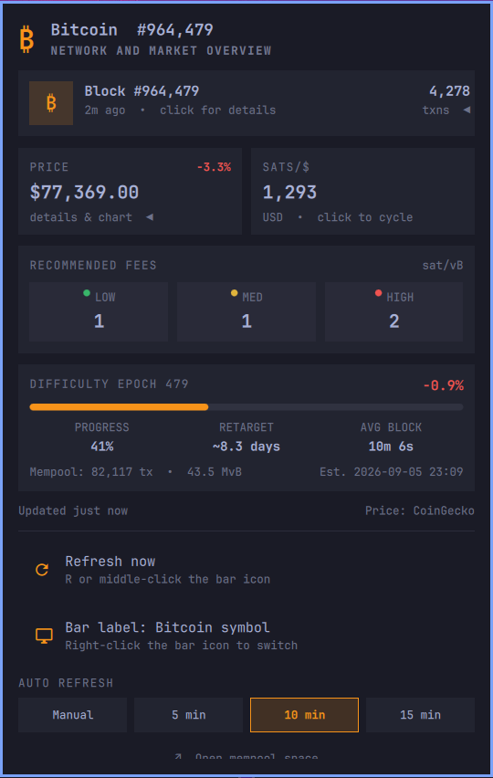
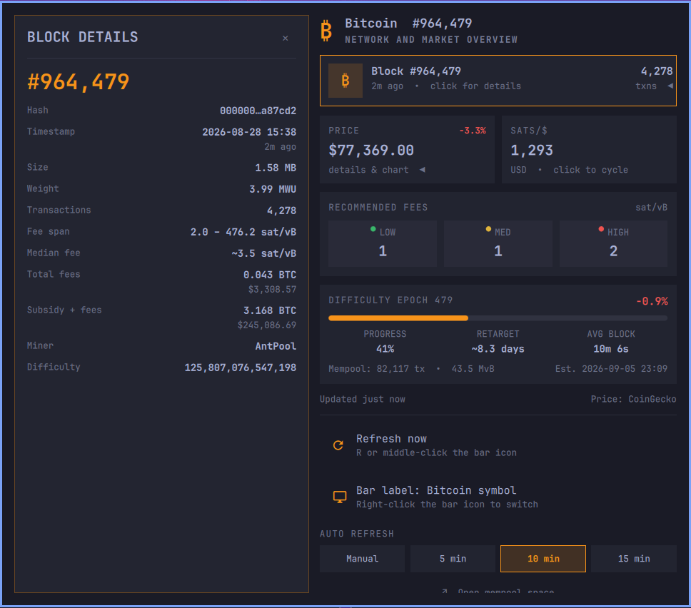
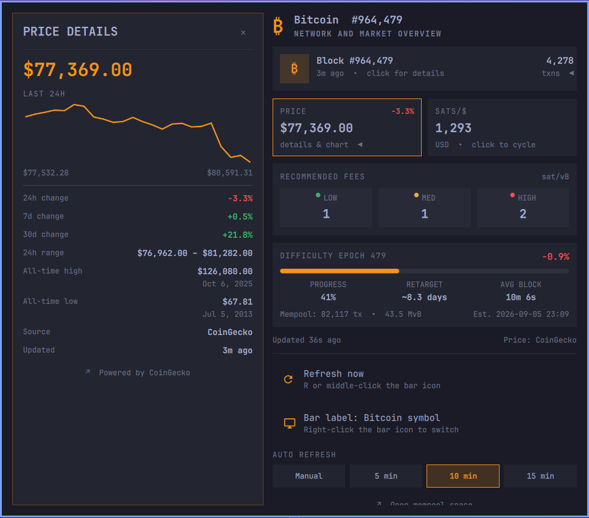

# Bitcoin Bar for Omarchy

A native [Omarchy](https://omarchy.org/) 4.0+ bar widget for live Bitcoin network and market data. It ports the compact card interface and interactions of [BitcoinBar for macOS](https://github.com/nmorton13/macos-bitcoin-menu-bar) to Quickshell while following Omarchy's bar, theming, keyboard, and popout conventions.



<table>
  <tr>
    <td></td>
    <td></td>
  </tr>
  <tr>
    <td align="center"><strong>Block details</strong></td>
    <td align="center"><strong>Price details</strong></td>
  </tr>
</table>

## Features

- Latest block height, age, transaction count, hash, timestamp, size, weight, fee span, median fee, total fees, reward, miner, and difficulty
- BTC/USD price and 24-hour change in the summary
- Animated **left-side block detail pane** when the block card is selected
- Animated **left-side price detail pane** with a 24-hour chart, 24h/7d/30d change, range, ATH/ATL and dates, clickable source attribution, and update age
- Sats-per-fiat display; click to cycle USD, EUR, GBP, JPY, CAD, AUD, CHF, CNY, HKD, and SGD
- Low, medium, and high recommended fees
- Mempool transaction count and virtual size
- Difficulty epoch, progress, projected adjustment, average block time, remaining time, and estimated retarget date
- Manual and 5/10/15-minute automatic refresh options
- Partial-success updates, last-good values, stale state, bounded curl timeouts, capped response sizes, retries, and exponential retry backoff
- Persistent settings through Omarchy's supported `shell.json` API
- Theme-aware colors and standard Omarchy popup ownership and keyboard behavior
- No accounts, API keys, analytics, advertising, or tracking

## Install

```bash
omarchy plugin add https://github.com/nmorton13/omarchy-bitcoin-bar.git --enable
```

Omarchy validates the repository and installs it as:

```text
~/.config/omarchy/plugins/nmorton.bitcoin/
```

Plugins execute inside the long-running Omarchy shell process. Review third-party plugin source before enabling it.

### Remove

```bash
omarchy plugin remove nmorton.bitcoin
```

## Interaction

| Input | Action |
|---|---|
| Left-click bar icon | Open or close the summary |
| Middle-click bar icon | Refresh |
| Right-click bar icon | Switch between the Bitcoin symbol and block height |
| Block card or `B` | Toggle the left-side block details |
| Price card or `P` | Toggle the left-side chart and price details |
| Sats card or `C` | Cycle fiat currency |
| `R` | Refresh |
| Arrow keys | Move between rows; Left opens details and Right closes them |
| Escape | Close details first, then the panel |
| Tab / Shift-Tab | Switch to neighboring Omarchy bar panels |

## Requirements

- Omarchy 4.0+
- `curl` and `jq` (included with Omarchy)
- Network access to `mempool.space` and `api.coingecko.com`
- Node.js only for development tests

## Data sources

Six fixed requests run concurrently during a refresh:

- [mempool.space](https://mempool.space/): blocks, mempool, recommended fees with projected-block fallback, difficulty adjustment, and fallback fiat price
- [CoinGecko](https://www.coingecko.com/en/api): multi-fiat prices, market details, and sparkline

Every request is issued through `scripts/fetch-json.sh`, which enforces a per-endpoint byte cap while the body is received, so an oversized or endless response is abandoned and rejected before it reaches disk, `jq`, or the panel. The parsers in `Model.js` apply matching byte, item, and string caps as a second line of defence. Each request has connection and total timeouts plus one bounded retry. Successful endpoints update independently; failed endpoints retain their last-good values. A complete failure schedules exponential retries capped at five minutes. CoinGecko is preferred for detailed market data, with mempool.space as a USD fallback.

## Local development

Clone the repository and run the test suite:

```bash
git clone https://github.com/nmorton13/omarchy-bitcoin-bar.git
cd omarchy-bitcoin-bar
./tests/run.sh
```

To test a checkout in the live shell, copy it rather than symlinking it—Omarchy rejects plugin symlinks:

```bash
rm -rf ~/.config/omarchy/plugins/nmorton.bitcoin
cp -a . ~/.config/omarchy/plugins/nmorton.bitcoin
omarchy-shell shell rescanPlugins
omarchy plugin enable nmorton.bitcoin --section center
```

Files below `~/.config/omarchy/plugins/` hot-reload. A shell restart may be needed after changing popup geometry:

```bash
omarchy restart shell
```

## Validation

```bash
./tests/run.sh
```

The suite checks model parsing and formatting, currencies, epochs, subsidy calculations, retry backoff, chart helpers, staleness, JSON validity, manifest structure, entry points, shell syntax, and the native Omarchy validator when available.

Full interaction testing requires a running Omarchy shell because `qs.Commons` and `qs.Ui` are host-provided modules.

## Privacy

The plugin sends only fixed public-data HTTPS requests. Providers receive ordinary connection metadata such as IP address and timing. Preferences are stored only in the existing Omarchy user configuration.

## Contributing

Bug reports and focused pull requests are welcome. See [CONTRIBUTING.md](CONTRIBUTING.md) and [SECURITY.md](SECURITY.md).

## License

[MIT](LICENSE) © 2026 Nathan Morton
